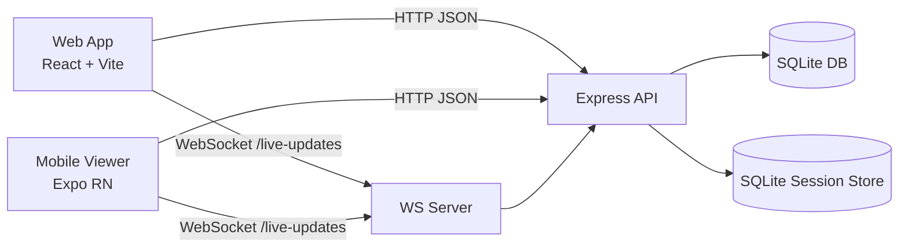

# TennisTracker

Full-stack tennis match management and live scoring platform with:
- Web app for authenticated match/player management and live point tracking
- Realtime score streaming over WebSockets
- SQLite-backed API with session-based auth
- Mobile read-only live viewer (Expo / React Native)


## Table of Contents

- [Overview](#overview)
- [Core Features](#core-features)
- [System Architecture](#system-architecture)
- [Tech Stack](#tech-stack)
- [Repository Structure](#repository-structure)
- [Data Model](#data-model)
- [API Surface](#api-surface)
- [Getting Started](#getting-started)
- [Environment Variables](#environment-variables)
- [Testing & Quality](#testing--quality)
- [Deployment](#deployment)
- [Localization](#localization)
- [Mobile Viewer](#mobile-viewer)
- [Roadmap Notes](#roadmap-notes)

## Overview

TennisTracker is designed for coaches, analysts, and competitive players who want structured tennis data from match setup to point-by-point live scoring.

The platform currently includes:
- Authenticated web dashboard for operational workflows
- Structured tennis entities: players, matches, and live sessions
- Realtime updates for active matches via `ws://.../live-updates?matchId=...`
- Per-point event logging and per-set stat aggregation
- Bilingual UI support (English/French)

## Core Features

### Web App (React + Vite)

- Authentication flow: signup, login, logout, session restore (`/auth/me`)
- Protected routes for management screens
- Player management (list, details, create)
- Match management (list, details, create)
- Live match control:
	- Create live session from existing match
	- Update session status (`scheduled`, `in-progress`, `suspended`, `completed`)
	- Record points with serve metadata and winner context
	- View live scoreboards and set-level statistics
- Public viewer route for live match visualization
- React Query caching/invalidation strategy for live data freshness

### Realtime Layer

- WebSocket endpoint at `/live-updates`
- Subscription by `matchId` via query param or subscribe message
- Server-side selective broadcast (`live-match-update`) to subscribed clients only
- Automatic client reconnect logic in web hook

### Backend (Express + SQLite)

- REST APIs for auth, players, matches, and live scoring
- Session-based auth via `express-session` with SQLite session store
- Tennis scoring workflow encoded in backend live scoring route:
	- point progression
	- deuce/advantage behavior via counters
	- game/set/match transitions
	- tie-break support
	- stat/event updates in transaction boundaries
- Database bootstrap on first run:
	- schema creation
	- optional dev admin seed
	- sample players/matches seed

### Mobile Viewer (Expo)

- Two-screen read-only experience:
	- live matches list
	- live match detail
- Consumes same REST + WebSocket live endpoints as web viewer

## System Architecture



### Runtime Boundaries

- `src/`: frontend SPA
- `server/`: API + WS server + DB bootstrap
- `mobile-viewer/`: independent Expo app for live viewing
- `database/`: persisted SQLite files (ignored in VCS)

## Tech Stack

### Frontend (Web)

- React 19 + TypeScript
- Vite 7
- React Router 7
- TanStack Query 5
- Tailwind CSS 4
- i18next + react-i18next
- React Hook Form + Zod
- Framer Motion

### Backend

- Node.js + Express 5
- better-sqlite3
- express-session + better-sqlite3-session-store
- ws (WebSocket server)
- bcryptjs (password hashing)
- dotenv + cors

### Mobile

- Expo 53
- React Native 0.79
- React Navigation

### Tooling

- ESLint 9
- Vitest 4 + Testing Library
- TypeScript project references

## Repository Structure

```text
tennistracker/
├── src/                 # Web frontend
├── server/              # Express API + live scoring + WebSocket
├── mobile-viewer/       # Expo mobile viewer app
├── database/            # SQLite files (runtime, ignored)
├── LIVE_SCORING.md      # Detailed live scoring model/API documentation
├── LOCALIZATION.md      # i18n setup and workflow
└── DEPLOYMENT.md        # Deployment guide (frontend + backend)
```

Important entry points:
- [src/main.tsx](src/main.tsx)
- [server/server.js](server/server.js)
- [server/db.js](server/db.js)
- [server/routes/live-scoring.js](server/routes/live-scoring.js)
- [mobile-viewer/src/api.ts](mobile-viewer/src/api.ts)

## Data Model

Core entities include:
- `players`
- `matches`
- `live_match_sessions`
- `live_sets`
- `live_games`
- `live_points`
- `live_match_events`
- `live_match_stats`
- `users`

The live scoring model supports event timelines, per-point logging, and per-set stat aggregation for both players.

For full schema details, see [LIVE_SCORING.md](LIVE_SCORING.md).

## API Surface

### Auth
- `POST /auth/signup`
- `POST /auth/login`
- `POST /auth/logout`
- `GET /auth/me`

### Players (protected)
- `GET /players`
- `GET /players/:id`
- `POST /players`

### Matches (protected)
- `GET /matches`
- `GET /matches/:id`
- `POST /matches`

### Live Scoring
- `GET /live-scoring/sessions`
- `POST /live-scoring/sessions` (protected)
- `GET /live-scoring/sessions/:matchId`
- `POST /live-scoring/sessions/:sessionId/point` (protected)
- status/set/stat endpoints (see [LIVE_SCORING.md](LIVE_SCORING.md))

### Health
- `GET /health`

## Getting Started

### Prerequisites

- Node.js 18+
- npm 9+

### 1) Install dependencies

From workspace root:

```bash
npm install
```

For backend:

```bash
cd server
npm install
```

For mobile viewer (optional):

```bash
cd mobile-viewer
npm install
```

### 2) Run backend API

```bash
cd server
npm run dev
```

Default API URL: `http://localhost:3003`

### 3) Run web app

In a separate terminal:

```bash
npm run dev
```

Default web URL: `http://localhost:5173`

### 4) Login (dev seed)

On first non-production boot, backend seeds default credentials:
- username: `admin`
- password: `tennis123`

Use only for local development; replace in real environments.

## Environment Variables

### Web (`.env` at root)

- `VITE_API_URL` (default: `http://localhost:3003`)
- `VITE_WS_URL` (optional override for WebSocket base URL)

### Backend (`server/.env`)

- `PORT` (default: `3003`)
- `NODE_ENV` (`development` or `production`)
- `SESSION_SECRET` (required in production)
- `FRONTEND_URL` (production origin for CORS allowlist)
- `SEED_DEFAULT_ADMIN` (`false` to disable local admin seeding)

### Mobile (`mobile-viewer/.env`)

- `EXPO_PUBLIC_API_URL`
- `EXPO_PUBLIC_WS_URL` (optional)

## Testing & Quality

From project root:

```bash
npm run lint
npm run test
npm run test:coverage
```

Test files are under [src/__tests__](src/__tests__).

## Deployment

Deployment split:
- Web frontend: Vercel
- Backend API + SQLite persistence: Render / Railway / Fly

Detailed guide: [DEPLOYMENT.md](DEPLOYMENT.md)

## Localization

- Supported languages: English (`en`), French (`fr`)
- i18n bootstrap in [src/i18n.ts](src/i18n.ts)
- Locale dictionaries in [src/locales/en.json](src/locales/en.json) and [src/locales/fr.json](src/locales/fr.json)

Localization guide: [LOCALIZATION.md](LOCALIZATION.md)

## Mobile Viewer

The Expo app lives in [mobile-viewer](mobile-viewer) and is intentionally scoped to live match consumption (not admin workflows).

See [mobile-viewer/README.md](mobile-viewer/README.md).

## Roadmap Notes

Planned or partially represented in UI/docs:
- expanded live tracker UX
- additional analytics depth
- broader match format support and experience refinements

---

Built for tennis analytics workflows with a clear separation of concerns between ingestion (live scoring), storage (SQLite), and presentation (web/mobile).
